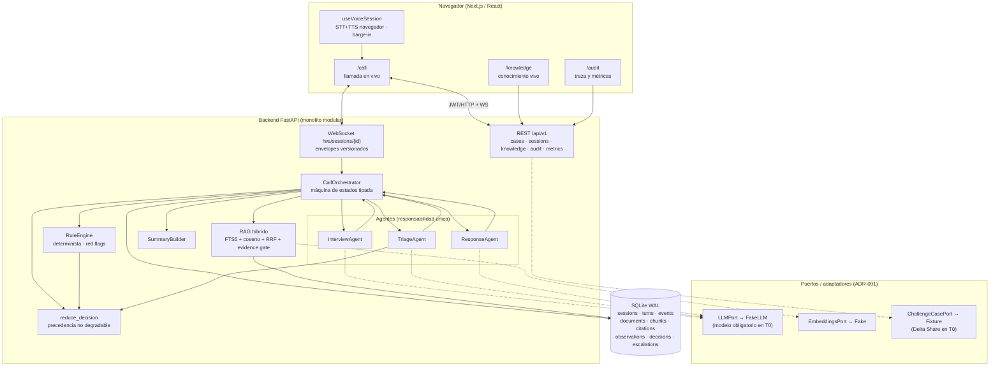
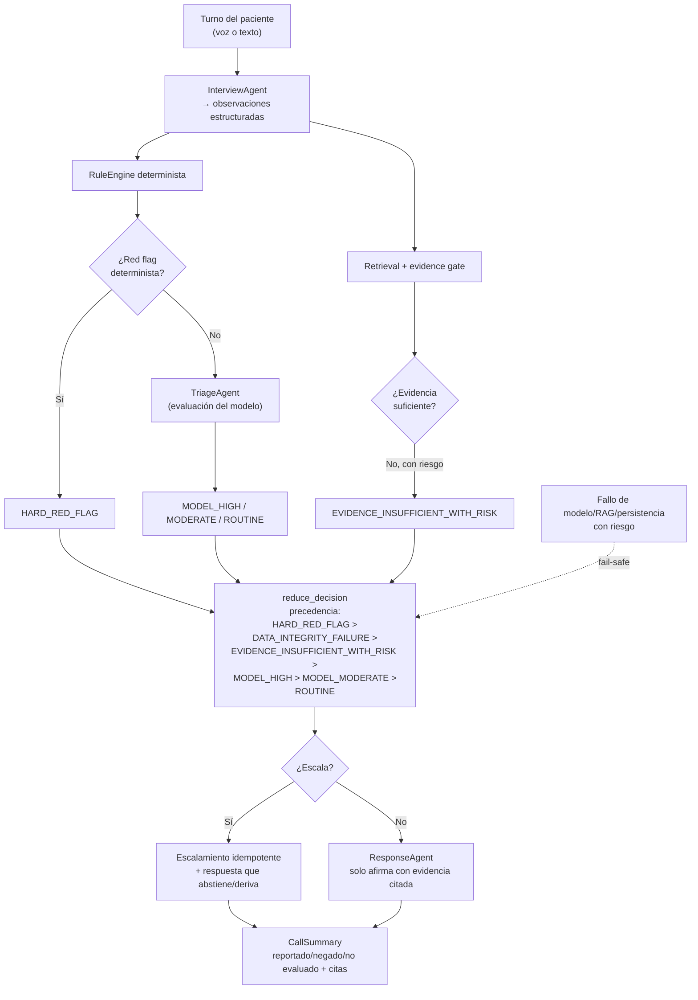

# Care Companion — Diagrama de arquitectura (DOC-002)

> v1.0 · 24 de julio de 2026 · Deriva de `architecture.md`. Renderizable en
> GitHub/artefactos (Mermaid). Muestra el sistema y el flujo de decisión.

## 1. Sistema

Regla estructural: **los agentes nunca se llaman entre sí**; solo el
orquestador coordina. El dominio no importa SDKs — todo proveedor entra por un
puerto.

## 2. Flujo de decisión (no degradable)

Invariante clínica: **la salida del modelo nunca rebaja** un nivel producido
por una regla determinista; silencio/dato ausente no es negación; sin evidencia
activa no hay afirmación clínica.
