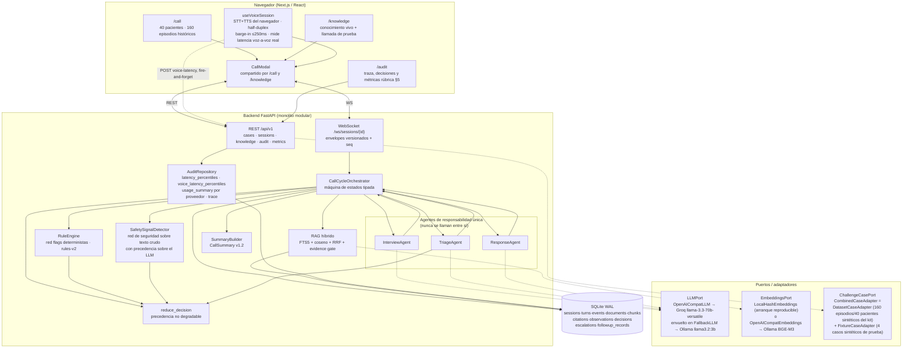
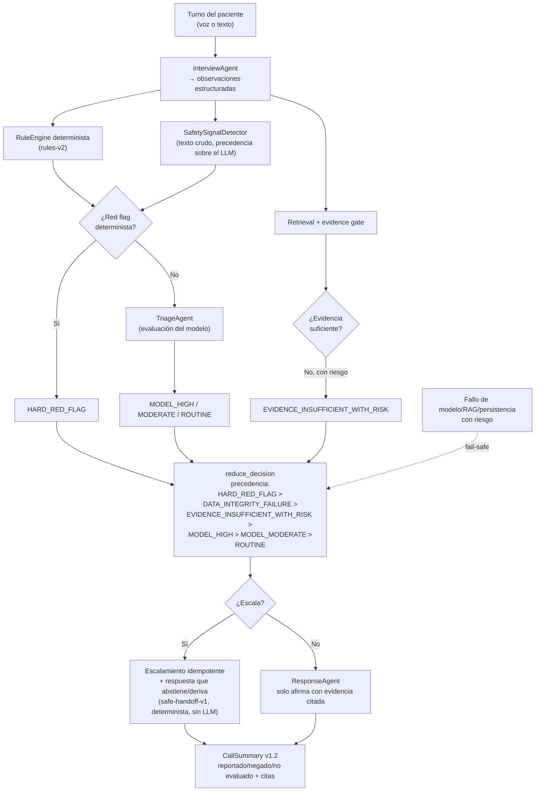

# Care Companion — Diagrama de arquitectura (DOC-002)

> v2.0 · 10 de agosto de 2026 · Deriva de [`architecture.md`](architecture.md).
> Renderizable en GitHub/artefactos (Mermaid). Muestra el sistema **tal como
> corre hoy**, no la propuesta previa al kit.

Reconstruido sobre v1.0 (24 de julio, previo al kit oficial): esa versión
mostraba un LLM simulado y `ChallengeCasePort → Fixture (Delta Share en T0)`.
Ninguno es seleccionable en el runtime actual (los dobles permanecen solo en
tests); nunca hubo Delta Share y el kit real trae `.xlsx` + PDFs. Con la
rúbrica evaluando el diagrama tomando piezas al azar y buscándolas en el
código (criterio "Comprensión del problema y diseño de la conversación"),
un diagrama desalineado con el repositorio es peor que no tenerlo. Esta
versión refleja los adapters reales, agrega la ruta de auditoría/métricas
(inexistente en v1.0) y el detector de seguridad determinista.

## 1. Sistema

Regla estructural: **los agentes nunca se llaman entre sí**; solo el
orquestador coordina. El dominio no importa SDKs — todo proveedor entra por
un puerto, incluido el resguardo (`FallbackLLM` decide sin que el dominio lo
sepa). `AuditRepository` separa tokens por proveedor real de cada llamada
(`by_provider`) para no cobrar precio de Groq por una llamada que en
realidad sirvió gratis el resguardo local.

## 2. Flujo de decisión (no degradable)

Invariante clínica: **la salida del modelo nunca rebaja** un nivel producido
por una regla determinista; silencio/dato ausente no es negación; sin
evidencia activa no hay afirmación clínica.
