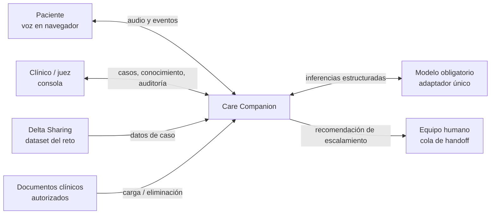
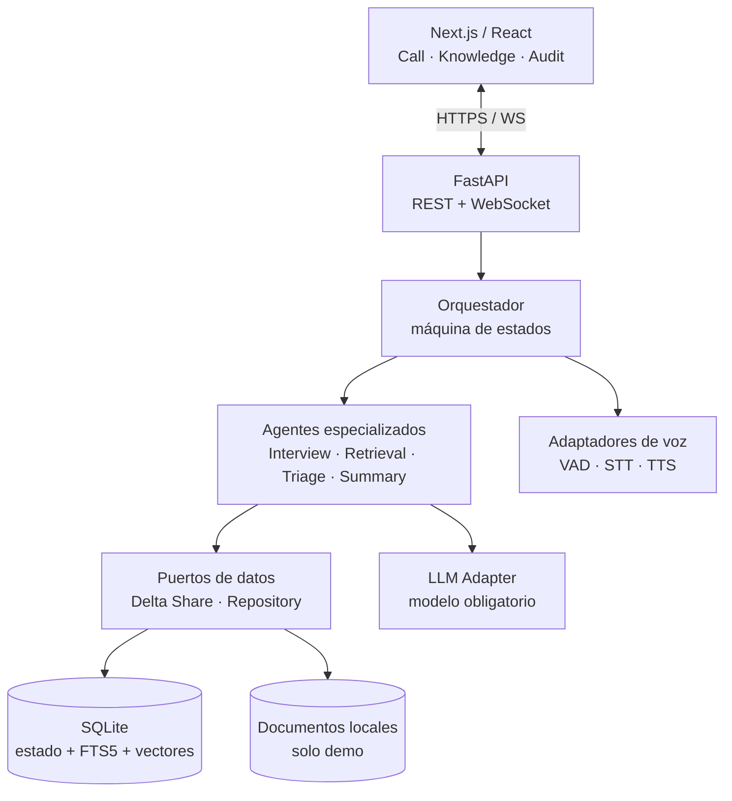
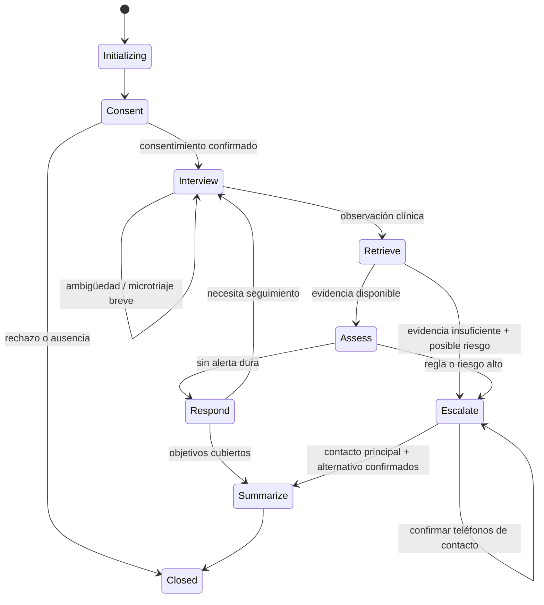
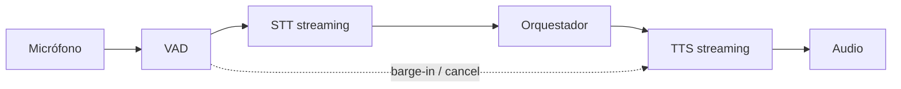

# Care Companion — Architecture

> SDD v0.1 · 23 de julio de 2026 · Estado: propuesta previa al reto  
> Concurso: Source Meridian Tech Sphere Challenge 2026 — Voice Agent Edition

## 1. Resumen de la decisión

Care Companion será un agente de voz en español para seguimiento postoperatorio que:

- conversa en tiempo real y tolera regionalismos, respuestas ambiguas e interrupciones;
- consulta únicamente una base de conocimiento clínico versionada;
- cita las fuentes que sustentan cada afirmación clínica;
- clasifica el riesgo con reglas deterministas y evaluación estructurada del modelo;
- escala a una persona cuando corresponde, sin ejecutar acciones clínicas autónomas;
- genera un resumen estructurado y una traza auditable de cada llamada;
- permite cargar y eliminar documentos en caliente, demostrando que el agente aprende y olvida;
- mantiene el LLM detrás de una interfaz para adoptar el modelo obligatorio que se anunciará el 7 de agosto.

La solución se construirá como **monolito modular desplegable**, no como microservicios. Los límites de dominio y los contratos se diseñan desde el inicio, pero todos los módulos corren inicialmente en un proceso FastAPI y una base SQLite. Esto maximiza la posibilidad de cumplir la compuerta de ejecución en ≤15 minutos y reduce fallos operativos durante los tres días del reto.

La multiagencia se implementa como una **máquina de estados dirigida por un orquestador**, con agentes de responsabilidad única. No se permitirá una conversación libre entre agentes, delegación recursiva ni loops no acotados.

## 2. Drivers arquitectónicos

### 2.1 Compuertas eliminatorias

La arquitectura debe garantizar:

1. los cuatro entregables: repositorio, diagramas, informe y video;
2. instalación y ejecución completa en ≤15 minutos siguiendo el README;
3. uso exclusivo del modelo obligatorio;
4. conversación de voz en tiempo real;
5. carga y eliminación funcional de conocimiento desde la consola.

### 2.2 Rúbrica pública

| Criterio | Peso | Respuesta arquitectónica |
|---|---:|---|
| RAG, precisión clínica y conocimiento vivo | 20 | recuperación híbrida, evidence gate, versionado, citas por turno, borrado verificable |
| Lógica de decisión y escalamiento | 20 | reglas deterministas + evaluación estructurada + precedencia de seguridad + explicación auditable |
| Comprensión y diseño de conversación | 15 | flujo postoperatorio por estados, preguntas adaptativas, español colombiano |
| Calidad de voz | 15 | audio streaming, VAD, barge-in, cancelación, métricas de latencia |
| Video y demo | 15 | recorrido determinista, casos semilla, panel de evidencia |
| Repositorio, proceso y buenas prácticas | 15 | monorepo, Docker, tests, ADR, commits pequeños, trazabilidad requisito→ticket→prueba |

Fuente primaria: [Tech Sphere Challenge 2026](https://sourcemeridian.com/tech-sphere-challenge#el-reto).

### 2.3 Restricciones

- Construcción competitiva: 7–10 de agosto; fecha/hora exacta de cierre pendiente de la ficha técnica.
- Implementación individual y repositorio público con licencia MIT.
- Dataset entregado por Delta Sharing; su conexión y consumo son parte del reto.
- El modelo obligatorio, compuertas detalladas y métricas exactas llegan el 7 de agosto.
- El agente habla español.
- No se requiere telefonía real, integración hospitalaria, autenticación empresarial ni cobertura de todos los procedimientos.
- No se incorporará código, prompts, datos, nombres de tablas ni información confidencial de `caregaps-agent`.
- No se almacenarán datos reales de pacientes ni secretos en el repositorio, los logs, el video o las capturas.
- La imagen y la marca de Akron Children’s son referencias de diseño; cualquier activo publicado exige autorización o sustitución por un activo propio/licenciado.

## 3. Principios

1. **Safety before fluency:** una respuesta natural nunca puede anular una regla de escalamiento.
2. **Evidence before answer:** una afirmación clínica necesita evidencia recuperada o una respuesta de abstención/escalamiento.
3. **Rules own the hard boundaries:** el LLM interpreta lenguaje y estructura, pero no controla secretos, autorizaciones, borrado ni precedencias de riesgo.
4. **One agent, one contract:** cada agente tiene entrada, salida, herramientas y presupuesto explícitos.
5. **Orchestration is code:** la transición entre estados vive en Python tipado y testeable.
6. **Observable by default:** cada turno produce eventos correlacionados sin bloquear la conversación.
7. **Portable core:** proveedores de LLM, voz, embeddings, almacenamiento y datos se conectan mediante puertos/adaptadores.
8. **Competition first, production path visible:** se implementa solo lo necesario para ganar el reto, dejando rutas de escalamiento claras.

## 4. Contexto del sistema



## 5. Arquitectura de contenedores



### 5.1 Frontend

- Next.js App Router + React + TypeScript.
- Tres rutas primarias:
  - `/call`: llamada en vivo, transcripción, evidencia, riesgo y escalamiento;
  - `/knowledge`: cargar, versionar, inspeccionar y eliminar documentos;
  - `/audit`: sesiones, decisiones, citas y métricas.
- Captura de audio mediante `AudioWorklet` o `MediaRecorder`, seleccionada el 7 de agosto según el contrato de voz.
- Un WebSocket por sesión para audio/eventos; REST para configuración, documentos, casos y reportes.

### 5.2 Backend

- Python + FastAPI + Pydantic.
- Endpoints REST para casos, conocimiento, auditoría, salud y métricas.
- WebSocket para audio bidireccional y eventos de baja latencia.
- Orquestador de estados en código; no es un “superprompt”.
- Repositorios async con SQLite en modo WAL.
- Tareas de ingestión cortas dentro del proceso; no se añade una cola distribuida durante el MVP.

FastAPI soporta comunicación WebSocket bidireccional y pruebas con `TestClient`: [documentación oficial](https://fastapi.tiangolo.com/advanced/websockets/).

## 6. Diseño multiagéntico

### 6.1 Agentes y límites

| Componente | Responsabilidad única | Puede usar | No puede hacer |
|---|---|---|---|
| `CallOrchestrator` | mantener estado, decidir siguiente paso y presupuestos | contratos de agentes y servicios | redactar consejo clínico, improvisar herramientas, delegar recursivamente |
| `InterviewAgent` | formular/interpretar preguntas conversacionales y extraer observaciones | contexto mínimo de sesión, glosario regional | diagnosticar, decidir riesgo final, consultar datos arbitrarios |
| `RetrievalAgent` | construir consulta y recuperar evidencia clínica | `KnowledgeSearchPort` | responder sin fuentes, cambiar el índice, decidir escalamiento |
| `ResponseAgent` | redactar respuesta breve y empática usando evidencia aprobada | observaciones + fragmentos citables + decisión | introducir hechos no sustentados, prescribir o invalidar una alerta |
| `TriageAgent` | producir evaluación de riesgo estructurada y explicación | observaciones normalizadas + reglas + evidencia | desactivar reglas deterministas, ejecutar la alerta |
| `SummaryAgent` | generar resumen final estructurado | eventos y decisiones de la sesión | reabrir conversación, inventar datos ausentes |
| `KnowledgeIngestionService` | validar, fragmentar, indexar y borrar documentos | parsers, embeddings, repositorio | hacer razonamiento clínico; se implementa como servicio determinista, no LLM agent |
| `SafetyPolicyEngine` | aplicar reglas de precedencia, abstención y escalamiento | reglas versionadas | ser modificado por prompts o respuestas del modelo |

### 6.2 Contrato base de agente

```python
class AgentRequest(BaseModel):
    session_id: UUID
    correlation_id: UUID
    knowledge_version: int
    payload: dict
    deadline_ms: int

class AgentResult(BaseModel):
    status: Literal["ok", "abstain", "error"]
    output: dict
    evidence: list["CitationRef"] = []
    confidence: float | None = None
    usage: "UsageMetrics"
    warnings: list[str] = []
```

Reglas del contrato:

- salida estructurada validada por Pydantic;
- tiempo, tokens e intentos máximos por agente;
- cero llamadas entre agentes: el orquestador es el único coordinador;
- máximo un reintento por error transitorio;
- fallback determinista ante timeout, JSON inválido o falta de evidencia;
- cada resultado incluye `correlation_id`, `knowledge_version` y métricas.

## 7. Flujo de llamada



### 7.1 Secuencia por turno

1. STT entrega texto parcial y final.
2. `InterviewAgent` extrae observaciones normalizadas y ambigüedades.
3. `SafetyPolicyEngine` evalúa red flags inmediatas.
4. Un malestar intenso pero inespecífico (“muy mal”) activa un solo microtriaje de peligro
   inmediato; no se presenta como solicitud explícita de urgencia.
5. Si existe red flag dura, bloquea el camino normal y crea `escalate`.
6. `RetrievalAgent` recupera evidencia filtrada por procedimiento y fase.
7. `TriageAgent` evalúa riesgo estructurado sin poder rebajar una regla dura.
8. `ResponseAgent` genera una intervención breve con citas internas.
9. TTS empieza a transmitir; una nueva voz del paciente cancela la reproducción.
10. Los eventos se escriben asíncronamente y con política fail-open para telemetría no clínica.

## 8. Lógica de decisión y escalamiento

### 8.1 Modelo de precedencia

```text
HARD_RED_FLAG
  > DATA_INTEGRITY_FAILURE
  > EVIDENCE_INSUFFICIENT_WITH_RISK
  > MODEL_HIGH_RISK
  > MODEL_MODERATE_RISK
  > ROUTINE_FOLLOW_UP
```

Una decisión de mayor severidad nunca puede ser degradada por el LLM.

### 8.2 Salida de triage

```json
{
  "level": "urgent_human_review",
  "should_escalate": true,
  "trigger_codes": ["WOUND_HEAT", "PAIN_WORSENING"],
  "observations_used": ["..."],
  "evidence_ids": ["chunk-17", "chunk-22"],
  "missing_information": ["temperature_c"],
  "rationale_for_audit": "Combination requires human review under rule set v3.",
  "patient_message_intent": "explain_handoff_without_diagnosis"
}
```

### 8.3 Handoff

En el reto, “alertar” es un handoff visible, persistente y auditable dentro de la aplicación:

- crea un registro `escalation`;
- cambia el estado de la sesión;
- muestra la justificación, señales y fuentes;
- solicita teléfono principal y contacto alternativo;
- incorpora ambos al reporte y cierra automáticamente la llamada;
- no depende de un botón ni de un operador para crear el handoff.

## 9. RAG y conocimiento vivo

### 9.1 Estrategia MVP

SQLite es suficiente para el estado operacional y un corpus pequeño/mediano del reto:

- `documents` y `document_versions` para identidad, checksum y estado;
- `chunks` para texto y metadatos;
- FTS5 para búsqueda léxica/BM25;
- embeddings serializados como BLOB;
- similitud coseno calculada con NumPy sobre candidatos acotados;
- fusión de rankings por Reciprocal Rank Fusion;
- reranking opcional solo si mejora una evaluación medida.

FTS5 es un módulo oficial de búsqueda de texto completo de SQLite: [documentación](https://www.sqlite.org/fts5.html).

La elección evita servicios adicionales y extensiones nativas frágiles. El puerto `VectorSearchPort` permite migrar después a Databricks Vector Search, pgvector u otro motor.

### 9.2 Pipeline de ingestión

1. validar tipo, tamaño, MIME, nombre y antivirus/guardas básicas;
2. calcular SHA-256 y rechazar duplicados no intencionales;
3. extraer texto y conservar páginas/secciones;
4. fragmentar por estructura semántica, no por tamaño ciego;
5. generar metadatos: procedimiento, audiencia, vigencia, fuente y sección;
6. generar embeddings con adaptador configurable;
7. escribir documento, chunks, embeddings y FTS en una transacción;
8. incrementar `knowledge_version`;
9. ejecutar consulta canaria y mostrar estado `ready`.

### 9.3 Borrado verificable

El borrado debe demostrar olvido:

1. marcar versión `deleting`;
2. eliminar chunks, FTS, embeddings y cachés dentro de una transacción;
3. conservar únicamente un tombstone sin texto clínico: id, checksum, actor y fecha;
4. incrementar `knowledge_version`;
5. ejecutar una consulta canaria que confirme ausencia;
6. impedir que una sesión nueva use una versión antigua;
7. registrar evidencia de borrado para la demo.

### 9.4 Evidence gate

El sistema no permite que `ResponseAgent` genere una afirmación clínica si:

- no hay fragmentos por encima del umbral;
- los fragmentos pertenecen a otra versión eliminada;
- la fuente no coincide con procedimiento/fase aplicable;
- existe conflicto no resuelto entre documentos;
- faltan metadatos obligatorios de procedencia.

El fallback es pedir aclaración, dar una respuesta no clínica o escalar; nunca completar por conocimiento general del modelo.

## 10. Voz en tiempo real

### 10.1 Pipeline



### 10.2 Decisión diferida al 7 de agosto

El puerto de voz soportará dos implementaciones:

- **Opción A — WebSocket pipeline:** proveedor STT + modelo obligatorio + proveedor TTS; mayor control y mejor trazabilidad.
- **Opción B — API realtime compatible con el modelo obligatorio:** menor latencia si la ficha técnica y el proveedor lo permiten.

Se elegirá mediante un spike de 90 minutos con cuatro criterios: cumplimiento del modelo, latencia P95, interrupciones y reproducibilidad.

### 10.3 Presupuestos iniciales

Son objetivos internos hasta recibir las métricas oficiales:

| Métrica | Objetivo |
|---|---:|
| primera transcripción parcial | ≤500 ms P95 |
| fin de habla → primera respuesta audible | ≤2.5 s P95 |
| cancelación por barge-in | ≤250 ms P95 |
| reconexión recuperable | ≤3 s |
| pérdida tolerada de eventos auditables | 0 |

## 11. Datos y persistencia

### 11.1 Entidades principales

| Entidad/tabla | Propósito |
|---|---|
| `patients` | agregado Pydantic en memoria construido desde los XLSX oficiales |
| `followup_episodes` | 160 hitos históricos agrupados bajo 40 pacientes |
| `sessions` | ciclo de vida y versión de conocimiento fijada |
| `turns` | transcripción, speaker, tiempos y estado |
| `observations` | síntomas/atributos normalizados y procedencia |
| `decisions` | nivel, triggers, reglas, evidencia y explicación |
| `escalations` | handoff idempotente enviado a revisión humana |
| `followup_records` | proyección semiestructurada persistida de la llamada nueva y su alerta |
| `summaries` | JSON estructurado y versión de schema |
| `documents` | identidad lógica del documento |
| `document_versions` | checksum, vigencia y estado |
| `chunks` | texto, página/sección y metadatos |
| `citations` | relación turno↔chunk↔documento |
| `agent_events` | inicio/fin/error/abstención por agente |
| `usage_metrics` | latencia, tokens, costo y proveedor |
| `audit_events` | cambios de conocimiento y acciones administrativas |

### 11.2 Aislamiento

- `session_id` y `case_id` son obligatorios en todos los repositorios.
- Nunca se reutiliza memoria de conversación entre sesiones.
- Cada sesión fija una `knowledge_version`; una eliminación invalida nuevas sesiones y cachés.
- Las vistas de auditoría redactan contenido sensible por defecto.

### 11.3 Dataset oficial y agregado longitudinal

`ChallengeCasePort` aísla los `.xlsx` oficiales de la lógica clínica:

```python
class ChallengeCasePort(Protocol):
    async def list_cases(self, filters: CaseFilters) -> list[CaseSummary]: ...
    async def get_case(self, case_id: str) -> ChallengeCase: ...
```

El adaptador:

- usa acceso de solo lectura;
- normaliza los 40 pacientes y agrupa sus días 1/3/7/14 en un contrato propio;
- conserva los 160 `case_id` originales para trazabilidad, aunque la UI solo
  presenta una entidad seleccionable por paciente;
- valida schema y nullability al inicio;
- no expone credenciales al frontend;
- entrega el historial como datos estructurados, no como embeddings RAG;
- persiste cada llamada nueva en `followup_records` con los ejes del dataset.

## 12. API propuesta

### 12.1 REST

| Método | Ruta | Uso |
|---|---|---|
| `GET` | `/health/live` | proceso vivo |
| `GET` | `/health/ready` | DB, modelo, voz y corpus listos |
| `GET` | `/api/cases` | casos de demo autorizados |
| `POST` | `/api/sessions` | iniciar sesión |
| `POST` | `/api/sessions/{id}/finish` | cerrar y resumir |
| `GET` | `/api/sessions/{id}` | estado y resumen |
| `GET` | `/api/sessions/{id}/trace` | traza auditable |
| `GET` | `/api/knowledge` | inventario y versión |
| `POST` | `/api/knowledge/documents` | cargar documento |
| `DELETE` | `/api/knowledge/documents/{id}` | borrar y verificar olvido |
| `POST` | `/api/knowledge/search` | depuración autorizada de RAG |
| `GET` | `/api/metrics` | P50/P95, tokens y costo |

### 12.2 WebSocket

`/ws/sessions/{session_id}` usa envelopes versionados:

```json
{
  "v": 1,
  "event": "transcript.final",
  "sequence": 42,
  "correlation_id": "uuid",
  "timestamp": "RFC3339",
  "payload": {}
}
```

Eventos clave: `audio.chunk`, `speech.started`, `speech.ended`, `transcript.partial`, `transcript.final`, `agent.state`, `evidence.updated`, `risk.updated`, `tts.chunk`, `tts.cancel`, `escalation.created`, `session.completed`, `error.recoverable`.

## 13. Observabilidad y evaluación

### 13.1 Trace tree

```text
call.session
├── voice.stt
├── agent.interview
├── safety.rules
├── rag.retrieve
├── agent.triage
├── agent.response
├── voice.tts
└── agent.summary
```

Cada span registra:

- `session_id` pseudónimo y `correlation_id`;
- componente, modelo/config hash y prompt version;
- inicio, fin, resultado, latencia y retry count;
- tokens de entrada/salida y costo calculado;
- ids de evidencia, no chain-of-thought;
- regla/decisión y versión de conocimiento.

La escritura de telemetría no crítica es asíncrona y fail-open; la escritura de decisiones, citas y escalamiento es transaccional y no puede perderse silenciosamente.

### 13.2 Evaluaciones

- unitarias para reglas, contratos, ranking y borrado;
- integración para WebSocket, ingestión y Delta Share;
- conversación simulada para casos routine/moderate/urgent/ambiguous;
- RAG: recall@k, citation precision, groundedness y deletion test;
- triage: recall de red flags, false-negative count = 0 en casos críticos semilla;
- voz: latencia P50/P95, interrupción y recuperación;
- E2E para las cinco compuertas.

## 14. Seguridad, privacidad y propiedad intelectual

- Dataset y material del reto se tratan según sus términos; solo datos sintéticos/autorizados en demo.
- No se registran secretos, audio bruto ni PII innecesaria.
- `.env.example` contiene nombres, nunca valores secretos.
- Secret scanning antes de cada checkpoint y de la entrega.
- Upload con allowlist, límite de tamaño y nombre saneado; el contenido se trata como datos, no como instrucciones.
- Prompt-injection defense: el documento no puede redefinir políticas, herramientas ni reglas.
- El repositorio no incluye material confidencial de Akron Children’s ni de `caregaps-agent`.
- La fotografía oficial del campus puede usarse solo como referencia/prototipo hasta validar autorización. Para el repositorio público se reemplaza por un activo propio/licenciado si no existe permiso explícito.
- No se reproduce el logotipo de Akron Children’s sin aprobación.
- Los términos del concurso conceden amplios derechos de publicación y prohíben información confidencial o datos personales; el control de IP/privacidad es una compuerta de release.

## 15. Despliegue y reproducibilidad

### 15.1 MVP

```text
docker compose up --build
├── web      Next.js
└── api      FastAPI + SQLite + documentos demo
```

Objetivos:

- una única instrucción de arranque;
- health checks y seed idempotente;
- dependencias bloqueadas;
- `make verify` o equivalente para gates locales;
- perfil `demo` sin infraestructura externa salvo APIs exigidas;
- datos y documentos de muestra con licencia compatible.

La ficha técnica puede entregar un repositorio base; su estructura prevalece. Esta propuesta se adapta mediante puertos, no reemplazando automáticamente el starter.

### 15.2 Escalamiento posterior

| MVP | Evolución |
|---|---|
| SQLite | PostgreSQL/Databricks SQL según dominio |
| vectores en SQLite/NumPy | Databricks Vector Search |
| eventos in-process | Redis Streams/NATS/Kafka |
| archivos locales | object storage |
| una instancia WebSocket | gateway + sticky sessions/pub-sub |
| alerta simulada | cola clínica/Epic con autorización y confirmación |
| dataset Delta Share | tablas autorizadas de care gaps |
| trazas locales | MLflow tracing/observabilidad institucional |

## 16. Integración futura con `caregaps-agent`

### 16.1 Qué se reutiliza conceptualmente

- orquestador delgado;
- tool/agent registry explícito;
- allowlists de datos y herramientas;
- separación `formatted/output` + `metadata`;
- enrutamiento forzado para capacidades clínicas/analíticas;
- observabilidad async/fail-open;
- configuración por entorno y contratos Pydantic;
- resultados estructurados y trazabilidad.

### 16.2 Qué no se copia

- código propietario;
- prompts o descripciones de herramientas;
- tablas, catálogos, schemas, endpoints o credenciales;
- datos, ejemplos o screenshots de pacientes;
- nombres internos no publicados.

### 16.3 Seam de integración

Care Companion expone una capacidad futura `PostOpFollowUpCapability`:

```python
class PostOpFollowUpCapability(Protocol):
    async def start(self, context: FollowUpContext) -> SessionRef: ...
    async def handle_turn(self, session: SessionRef, utterance: str) -> TurnResult: ...
    async def finish(self, session: SessionRef) -> FollowUpSummary: ...
```

En `caregaps-agent`, esta capacidad podría registrarse como herramienta/capacidad separada. El agente existente decidiría cuándo iniciar el workflow, pero no controlaría el triage interno ni recibiría audio/PII más allá de lo autorizado.

### 16.4 Boundary para Epic

Una integración real se separaría en:

1. **read adapter:** contexto autorizado del paciente;
2. **decision support:** Care Companion propone y explica;
3. **human approval:** una persona valida;
4. **write adapter:** ejecuta una acción limitada, idempotente y auditable.

No se permitirá que Databricks, el LLM o el agente ejecuten escrituras directas en Epic sin autorización, scopes mínimos, validación humana y reconciliación.

## 17. Decisiones ADR

| ADR | Decisión | Estado |
|---|---|---|
| ADR-001 | monolito modular durante el reto | aceptada |
| ADR-002 | orquestación como máquina de estados en Python | aceptada |
| ADR-003 | SQLite + FTS5 + vectores BLOB/NumPy para MVP | propuesta |
| ADR-004 | reglas deterministas tienen precedencia sobre LLM | aceptada |
| ADR-005 | proveedor de LLM y voz detrás de adapters | aceptada |
| ADR-006 | fotografía/marca del hospital requiere autorización antes de publicación | aceptada |
| ADR-007 | estrategia concreta de voz | pendiente del 7 de agosto |
| ADR-008 | modelo y embeddings | pendiente de ficha técnica |
| ADR-009 | schema de Delta Share | pendiente del dataset |

## 18. Riesgos

| Riesgo | Impacto | Mitigación |
|---|---|---|
| modelo obligatorio no soporta el flujo previsto | alto | adapter y spike obligatorio T+0 |
| latencia de voz excesiva | eliminatorio | streaming, barge-in, presupuestos y modo fallback |
| borrado deja chunks/cachés | eliminatorio | transacción + knowledge version + consulta canaria |
| RAG recupera fuente incorrecta | alto | filtros de aplicabilidad, hybrid retrieval, evidence gate |
| falso negativo clínico | crítico | reglas conservadoras, casos críticos, precedencia no degradable |
| sobrearquitectura en tres días | alto | monolito modular, freeze de alcance, vertical slice primero |
| starter/dataset difieren de supuestos | alto | sprint de intake y ADR delta el 7 de agosto |
| secretos/PHI en repo o video | crítico | datos sintéticos, redacción, secret scan, release checklist |
| uso no autorizado de marca/foto | alto | activo reemplazable y revisión IP antes de publicar |
| SQLite bloquea bajo concurrencia | medio en MVP | WAL, transacciones cortas; migración posterior |

## 19. Criterios de aceptación arquitectónicos

- [ ] Una llamada completa atraviesa voz→orquestador→RAG→triage→respuesta→resumen.
- [ ] Cada afirmación clínica visible tiene al menos una cita válida.
- [ ] Una red flag determinista no puede ser degradada por ninguna salida del modelo.
- [ ] La eliminación de un documento impide recuperarlo en sesiones nuevas y se prueba automáticamente.
- [ ] Un fallo de telemetría no interrumpe la llamada; un fallo de persistencia clínica sí produce estado seguro.
- [ ] El modelo obligatorio se configura en un solo adapter y no existen llamadas a otros LLM.
- [ ] El proyecto arranca desde cero en ≤15 minutos con el proceso definido por la ficha técnica.
- [ ] El repositorio público no contiene secretos, PII, PHI, información institucional confidencial ni activos sin licencia.
