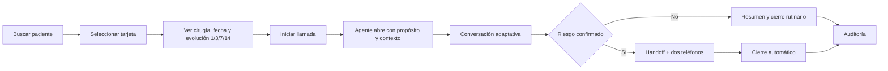

# Care Companion — Diseño de producto y experiencia

> v1.0 · 9 de agosto de 2026. Describe la interfaz implementada; sustituye la
> exploración visual pediátrica previa al kit oficial.

## 1. Concepto

Care Companion presenta el seguimiento postoperatorio como una llamada que
escucha, recuerda y escala. La interfaz debe permitir que el jurado compruebe
tres cosas sin interpretar información técnica innecesaria:

1. el agente conoce al paciente y su evolución;
2. la conversación se adapta y usa evidencia;
3. una señal de riesgo termina en un registro humano accionable.

La experiencia se dirige al paciente. Un familiar/cuidador puede participar
cuando corresponda, pero no se presupone pediatría ni que siempre exista un
intermediario.

## 2. Audiencias y modo de uso

| Audiencia | Necesidad |
|---|---|
| Paciente/familiar | conversación clara, breve y empática; saber qué ocurrirá después |
| Equipo humano | síntomas, evolución, evidencia, decisión y contactos en un solo registro |
| Jurado | iniciar una demo rápido y verificar voz, memoria, RAG, riesgo y trazabilidad |

La demo es autogestionada: el humano selecciona un paciente sintético e inicia
la llamada; desde allí el agente abre, conduce, escala y cierra. No existe una
consola para que un operador escriba cada turno.

## 3. Arquitectura de información

La navegación superior tiene tres destinos:

- **Llamada:** selección de paciente y conversación en vivo.
- **Base clínica:** consola learn/retrieve/forget exigida por G5.
- **Auditoría:** sesiones terminadas, traza, seguimiento y métricas.

“Base clínica” no es una segunda experiencia para el paciente: es el
back-office mínimo pedido por el concurso. Su carga de archivos permite que el
jurado demuestre que el agente aprende y olvida conocimiento en caliente.

## 4. Flujo principal

## 5. Pantalla Llamada

### 5.1 Antes de iniciar

Orden visual:

1. título e instrucción breve;
2. buscador por paciente o procedimiento;
3. tarjetas con nombre, cirugía y fecha;
4. ficha del paciente seleccionado con evolución histórica;
5. CTA **Iniciar llamada**.

Las 40 entidades se muestran como pacientes únicos. Los días 1/3/7/14 no son
opciones de llamada; aparecen como memoria longitudinal dentro de la ficha.

### 5.2 Durante la llamada

Al iniciar, la cuadrícula de selección se colapsa por completo. Permanece una
ficha compacta con nombre, procedimiento y fecha. La primera pantalla visible
prioriza:

1. estado de voz y control de interrupción/finalización;
2. transcripción;
3. evidencia citada;
4. riesgo y handoff.

La evolución histórica se resume en cuatro columnas (días 1/3/7/14) y seis
filas: dolor, temperatura, movilidad, herida, apetito y sueño. No compite con
la conversación; se muestra como memoria verificable antes de iniciar o en una
sección compacta durante la llamada.

### 5.3 Estados de voz

| Estado interno | Etiqueta humana |
|---|---|
| idle | Listo para iniciar |
| listening | Escuchando |
| processing | Analizando la respuesta |
| speaking | Respondiendo |
| interrupted | Interrumpido por el paciente |
| error | No fue posible continuar por voz |
| unsupported | Voz no disponible; puede usar texto |

El campo “Escribe lo que dice el paciente” no aparece cuando la voz está
disponible. El fallback de texto debe estar rotulado como alternativa técnica,
no como operación normal por un humano.

### 5.4 Conversación

- La apertura explica propósito, procedimiento, fecha y continuidad del
  seguimiento.
- Un saludo recibe un saludo, no “gracias por contarme”.
- Los acuses varían y solo se usan cuando aportan naturalidad.
- Una respuesta ya comprendida no provoca la misma pregunta.
- “Muy mal” produce un microtriaje breve; una señal concreta escala sin alargar
  el cuestionario.
- El handoff informa que el reporte quedó enviado, solicita dos teléfonos y
  cierra automáticamente.

### 5.5 Riesgo

| Nivel técnico | Etiqueta humana | Presentación |
|---|---|---|
| `ROUTINE_FOLLOW_UP` | Seguimiento rutinario | verde/neutral |
| `MODEL_MODERATE_RISK` | Revisión recomendada | ámbar |
| `MODEL_HIGH_RISK` | Atención prioritaria | rojo |
| `HARD_RED_FLAG` | Atención urgente | rojo intenso |
| `EVIDENCE_INSUFFICIENT_WITH_RISK` | Riesgo con información insuficiente | ámbar/rojo |
| `DATA_INTEGRITY_FAILURE` | Revisión por falla de datos | rojo técnico |

La decisión nunca se comunica como diagnóstico. El panel explica hallazgos,
evidencia faltante, registro de handoff y siguiente paso humano.

## 6. Pantalla Base clínica

Objetivo: demostrar G5 de forma visible y guiada.

Jerarquía:

1. versión activa y cantidad de documentos en una banda compacta;
2. flujo de tres pasos: cargar, probar, eliminar;
3. formulario de carga;
4. inventario con estado, procedimiento, versión y acción;
5. consulta canaria y resultado.

La tarjeta de versión no debe reservar un gran espacio vacío. El corpus oficial
se distingue del material agregado por el jurado y no ofrece una acción de
borrado. Cada resultado de búsqueda muestra título, sección/página y versión.

## 7. Pantalla Auditoría

Al entrar se selecciona automáticamente la última llamada terminada. La tabla
incluye:

- paciente y procedimiento;
- fecha/hora y duración;
- estado humano;
- decisión humana;
- fuentes y handoff;
- botón explícito **Ver detalle**.

Las filas no dependen de una interacción invisible. `closed`, `interviewing` y
`HARD_RED_FLAG` se traducen en presentación, aunque el valor técnico se
conserve en la traza.

El detalle ordena:

1. resumen clínico consolidado;
2. decisión y handoff;
3. contactos confirmados;
4. citas;
5. timeline técnico;
6. métricas.

Tokens y costo se muestran como cifras de operación con `n`, ventana y modelo,
no como tarjetas de depuración. Si no existe una muestra válida, se muestra
“Sin llamadas cerradas con modelo real” y nunca un cero inventado.

## 8. Sistema visual

- Azul oscuro: estructura, títulos y confianza.
- Turquesa: voz activa, foco y continuidad.
- Verde: disponibilidad/rutina confirmada.
- Ámbar: atención o información incompleta.
- Rojo: urgencia/handoff.
- Fondos claros y tarjetas blancas para legibilidad clínica.

La identidad es propia de Care Companion. No usa logos, fotografías ni trade
dress de un hospital. El diseño no se presenta como pediátrico: el dataset
abarca pacientes y procedimientos diversos.

## 9. Accesibilidad y responsive

- contraste WCAG 2.2 AA;
- foco visible y orden de teclado coherente;
- estados comunicados por texto e icono, no solo color;
- modales con focus trap y cierre por Escape;
- `prefers-reduced-motion` respeta movimiento reducido;
- controles táctiles de al menos 44 px;
- desktop: conversación 2/3 + rail 1/3;
- tablet/móvil: una columna, conversación antes que evidencia/riesgo.

## 10. Criterios de aceptación

- [x] Selección por paciente único, no por día.
- [x] Tarjetas con nombre, cirugía y fecha.
- [x] Evolución histórica visible antes de la llamada.
- [x] Selector colapsado durante la conversación.
- [x] Voz como interacción principal; texto solo fallback.
- [x] Handoff automático visible y cierre automático.
- [x] Base clínica explica y demuestra learn/forget.
- [x] Auditoría identifica paciente/procedimiento y abre la última llamada.
- [x] Estados y decisiones tienen etiquetas humanas.
- [x] Métricas muestran alcance/denominador o estado pendiente honesto.
