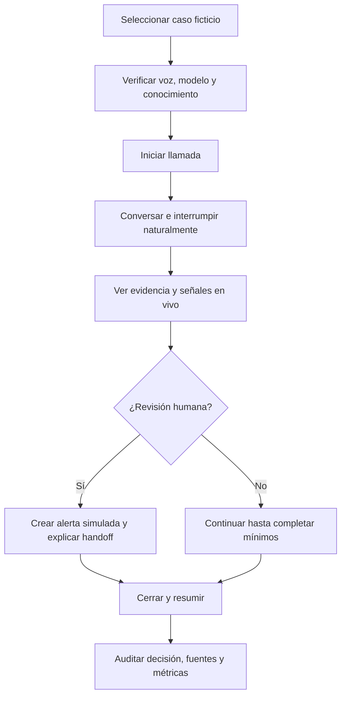

# Care Companion — Product & Experience Design

> SDD v0.2 · 23 de julio de 2026 · Estado visual: **Opción 3 — Family-first Pediatric seleccionada e implementada**

## 1. Concepto

**Care Companion** presenta la llamada postoperatoria como una conversación acompañada por evidencia y supervisión humana. La experiencia debe sentirse cercana para el paciente y rigurosa para un profesional o evaluador.

Principio visual:

> La voz ocupa el centro; evidencia, riesgo y supervisión siempre permanecen visibles.

El producto no se diseña como un chatbot genérico. La unidad principal es una **llamada clínica en curso** con cuatro capas observables:

1. qué dice el paciente;
2. qué entiende el sistema;
3. qué conocimiento sustenta la respuesta;
4. por qué interviene —o no— una persona.

## 2. Audiencia y modo de uso

La demo tiene una doble audiencia:

- **paciente simulado:** necesita lenguaje claro, control del micrófono, estado de escucha y tranquilidad;
- **profesional/evaluador:** necesita señales, fuentes, decisión, latencia y traza sin abandonar la llamada.

La interfaz desktop prioriza la evaluación y el demo. La vista móvil se contempla como adaptación posterior; no comprometerá la experiencia crítica desktop durante el reto.

## 3. Arquitectura de información

| Ruta | Pregunta que responde | Contenido |
|---|---|---|
| `/call` | ¿Qué está ocurriendo ahora? | voz, transcripción, observaciones, evidencia, riesgo y escalamiento |
| `/knowledge` | ¿Qué sabe el agente y desde qué versión? | documentos, estado, carga, eliminación y prueba de olvido |
| `/audit` | ¿Cómo llegó a esta respuesta/decisión? | sesiones, timeline, fuentes, agentes, prompts/config hashes y métricas |

Navegación primaria fija:

- **Llamada**
- **Conocimiento**
- **Auditoría**

El header incluye siempre:

- nombre del producto;
- badge **Prototipo clínico**;
- estado de preparación/supervisión;
- acceso a ayuda técnica para la demo.

## 4. Flujo de experiencia



## 5. Pantalla principal — Llamada

### 5.1 Jerarquía desktop

```text
Header: producto · navegación · prototipo/supervisión
Context rail: caso · procedimiento · duración · latencia · agente activo
┌──────────────────────────────┬─────────────────────┐
│ Conversación en vivo         │ Supervisión humana  │
│ waveform + mic + barge-in    │ riesgo + decisión   │
│ transcript                   ├─────────────────────┤
│ observaciones detectadas     │ Evidencia activa    │
│ siguiente pregunta           ├─────────────────────┤
│                              │ Foto institucional  │
└──────────────────────────────┴─────────────────────┘
```

### 5.2 Componentes

| Componente | Información | Interacción |
|---|---|---|
| `SessionContextBar` | paciente ficticio, procedimiento, tiempo, latencia | ninguna acción clínica |
| `VoiceStage` | waveform, estado escuchando/hablando/pausado | micrófono, pausa, finalizar |
| `LiveTranscript` | turnos parciales/finales y speaker | scroll, navegar a trace |
| `ObservationChips` | señales y certeza | abrir procedencia del turno |
| `NextQuestionCard` | pregunta propuesta | usar/editar solo si el rol de demo lo permite |
| `EvidencePanel` | fuentes aplicables y verificación | abrir documento/sección |
| `RiskPanel` | nivel, paso actual y supervisión | inspeccionar explicación |
| `EscalationAction` | recomendación de revisión | crear alerta simulada; requiere feedback explícito |
| `CampusEditorial` | conexión visual con pediatría | no es contenido clínico |

### 5.3 Estados de voz

| Estado | Visual | Copy |
|---|---|---|
| `ready` | micrófono neutral | “Listo para iniciar” |
| `listening` | halo + waveform aqua | “Escuchando” |
| `patient_speaking` | waveform activa | “Valentina está hablando” |
| `thinking` | progreso breve, sin spinner infinito | “Revisando lo que nos contaste” |
| `assistant_speaking` | waveform azul | “Care Companion está respondiendo” |
| `interrupted` | transición inmediata | “Te escucho” |
| `reconnecting` | banner no bloqueante | “Reconectando el audio…” |
| `failed` | texto + alternativa | “No pudimos recuperar el audio. Puedes continuar por texto.” |

### 5.4 Estados de riesgo

Color nunca será el único indicador.

| Nivel | Icono/label | Tratamiento |
|---|---|---|
| routine | check + “Seguimiento rutinario” | azul/teal |
| needs_clarification | pregunta + “Falta confirmar” | ámbar |
| human_review | persona/escudo + “Revisión humana” | coral |
| urgent_human_review | alarma + “Atención prioritaria” | coral fuerte + borde + texto |
| failed_safe | escudo + “Revisión requerida por seguridad” | neutral oscuro + acción clara |

## 6. Pantalla — Conocimiento

### 6.1 Objetivo

Hacer visible la promesa “sube un documento y aprende; elimínalo y olvida” sin depender de explicaciones técnicas.

### 6.2 Layout

- cabecera con `knowledge_version`, número de documentos activos y última actualización;
- zona de carga con tipos/tamaño permitidos;
- tabla de documentos:
  - título;
  - versión;
  - aplicabilidad;
  - estado;
  - número de chunks;
  - última prueba canaria;
  - acciones inspeccionar/eliminar;
- drawer de documento con páginas/secciones y ejemplos de recuperación;
- panel de actividad con `uploaded → processing → ready`;
- eliminación en dos pasos:
  1. confirmar impacto;
  2. mostrar `deleting → deleted` y resultado de prueba de olvido.

### 6.3 Prueba visual de aprendizaje

Después de cargar:

- badge `Ready`;
- `knowledge_version` incrementa;
- consulta canaria visible;
- fragmento/cita encontrada;
- botón “Usar en una llamada nueva”.

### 6.4 Prueba visual de olvido

Después de eliminar:

- documento sale de activos;
- `knowledge_version` incrementa;
- consulta canaria indica `0 resultados`;
- tombstone muestra solo id/checksum/fecha;
- sesiones anteriores conservan su traza histórica, claramente marcada con la versión usada.

## 7. Pantalla — Auditoría

### 7.1 Lista

Filtros por:

- fecha;
- resultado;
- escalamiento;
- procedimiento;
- versión de conocimiento;
- estado de la llamada.

Cada fila muestra duración, nivel, fuentes, latencia P95, tokens y costo.

### 7.2 Detalle

Timeline correlacionado:

```text
Paciente habló
→ InterviewAgent extrajo 2 observaciones
→ SafetyPolicy activó 1 regla
→ RetrievalAgent encontró 2 fuentes
→ TriageAgent recomendó human_review
→ ResponseAgent formuló handoff
→ alerta simulada creada
```

Paneles:

- transcript;
- observaciones originales/normalizadas;
- fuentes y ubicaciones;
- reglas y decisión;
- outputs estructurados;
- modelo/config/prompt versions;
- latencia/tokens/costo;
- errores y reintentos.

Nunca se muestra chain-of-thought.

## 8. Dirección de marca

### 8.1 Relación con Akron Children’s

La referencia institucional aporta:

- pediatría y cuidado familiar;
- azul profundo como ancla de confianza;
- fotografía editorial del campus;
- tono humano, no corporativo frío.

Uso recomendado:

- azul primario inspirado en `#004B8D`;
- blanco cálido y superficies claras;
- aqua/teal para actividad y evidencia;
- coral reservado para supervisión/escalamiento;
- fotografía oficial del campus como bloque editorial secundario.

No se debe:

- recrear o alterar el logotipo;
- afirmar que Care Companion es un producto oficial;
- usar una fotografía oficial en el repositorio público sin permiso;
- copiar componentes, textos o trade dress del sitio institucional.

Referencia: [Akron Children’s](https://www.akronchildrens.org/) y [página oficial del campus](https://www.akronchildrens.org/locations/Akron-Childrens-Hospital.html).

Para esta propuesta visual se carga temporalmente, desde su URL de origen, la foto publicada en la página oficial del campus. Antes de incorporar ese activo al repositorio público del concurso o al video final se reemplaza por una imagen propia/licenciada, salvo que exista autorización escrita.

## 9. Direcciones visuales

Se produjeron tres primeras vistas de 1440×900 con idéntico caso y contenido funcional. La dirección seleccionada es **Opción 3 — Family-first Pediatric**; las opciones 1 y 2 se conservan como alternativas archivadas y no cambian el alcance funcional.

Propuesta navegable seleccionada: [Care Intelligence Studio](https://care-intelligence-studio.sebastian-gaviria-2023.chatgpt.site).

### Opción 1 — Calm Clinical Editorial

Archivo: `option-1-calm-clinical.png`

- mayor balance entre calidez y claridad clínica;
- fondo blanco cálido, azul profundo y teal;
- conversación dominante con sidebar simple;
- adecuada si el demo debe sentirse como producto hospitalario accesible.

Tokens principales:

| Token | Valor |
|---|---|
| background | `#FBF9F5` |
| primary | `#004B8D` |
| text | `#17324D` |
| evidence | `#0F766E` |
| escalation | `#D85C52` |
| font | Source Sans 3 / Inter |
| radius | 16px |

### Opción 2 — Clinical Command Center

Archivo: `option-2-command-center.png`

- más técnica y explícita para jurados;
- shell azul marino, telemetría visible y superficies blancas;
- hace legibles routing, agente activo, latencia, señales y flujo de supervisión;
- adecuada si la defensa técnica pesa más que la sensación familiar.

Tokens principales:

| Token | Valor |
|---|---|
| shell | `#08243C` |
| surface-dark | `#0D314D` |
| telemetry | `#39D8F2` |
| evidence | `#22C7A9` |
| warning | `#F4B740` |
| escalation | `#FF6B5E` |
| font | IBM Plex Sans / Inter |
| radius | 12px |

### Opción 3 — Family-first Pediatric

Archivo: `option-3-family-first.png`

**Estado: seleccionada por el usuario el 23 de julio de 2026.**

- más amable, aireada y orientada a familia/paciente;
- voz y estado “Escuchando” muy prominentes;
- usa curvas, aqua, lima y amarillo suave;
- prioriza empatía y facilidad de uso sin ocultar evidencia, supervisión y trazabilidad;
- se implementa como propuesta navegable con tres vistas: Llamada, Conocimiento y Auditoría.

Tokens principales:

| Token | Valor |
|---|---|
| background | `#F7FAFC` |
| primary | `#004B8D` |
| aqua | `#22C7C9` |
| lime | `#A8D64F` |
| warmth | `#FFE6A3` |
| escalation | `#E96B64` |
| font | Nunito Sans / Inter |
| radius | 24–28px |

### Decisión visual

Se adopta la opción **3 — Family-first Pediatric** como contrato visual. La implementación preserva su voz dominante, superficies amplias, calidez pediátrica y supervisión humana visible, y recupera de la opción 2 únicamente la disciplina informativa necesaria para la rúbrica:

- Conocimiento muestra versión activa, fuentes, pipeline de agentes y prueba `learn → retrieve → forget`;
- Auditoría muestra timeline, resultados estructurados de agentes y métricas requeridas;
- los valores de latencia se presentan como **objetivos pendientes de medición**, no como resultados reales;
- todas las acciones clínicas, cargas y exportaciones de la propuesta están rotuladas como simulaciones;
- la fotografía de Akron Children’s se carga desde su fuente oficial únicamente como referencia visual y no implica afiliación ni autorización de uso público.

## 10. Tokens compartidos

Independientemente de la opción:

```css
:root {
  --space-1: 4px;
  --space-2: 8px;
  --space-3: 12px;
  --space-4: 16px;
  --space-6: 24px;
  --space-8: 32px;
  --control-min: 44px;
  --focus-ring: 0 0 0 3px rgba(57, 216, 242, 0.35);
  --motion-fast: 160ms;
  --motion-normal: 220ms;
}
```

- grid base: 8px;
- texto body desktop: 16px mínimo;
- controles: 44×44px mínimo;
- foco visible;
- elevación baja;
- iconos lineales consistentes;
- animación decorativa desactivable con `prefers-reduced-motion`.

## 11. Copy de referencia

### 11.1 Apertura

“Hola, soy Care Companion, un asistente de seguimiento. Quiero saber cómo te has sentido desde que llegaste a casa. Si detecto algo que necesite revisión, pediré ayuda al equipo. Esto no reemplaza la atención médica.”

### 11.2 Pregunta abierta

“Cuéntame con tus propias palabras cómo te has sentido desde que llegaste a casa.”

### 11.3 Aclaración

“Cuando dices que sientes ‘calor’, ¿te refieres a que la zona se siente caliente al tocarla, a que tienes fiebre o a otra sensación?”

### 11.4 Handoff

“Gracias por contármelo. Lo que describes necesita que una persona del equipo lo revise. Voy a dejar registrada la alerta para la demostración y te explicaré qué información se compartirá.”

### 11.5 Abstención

“No tengo suficiente información en las fuentes disponibles para responder eso con seguridad. Prefiero pedir una revisión humana.”

## 12. Accesibilidad

- contraste WCAG 2.2 AA;
- navegación completa por teclado;
- foco visible y orden lógico;
- labels accesibles para micrófono, pausa, finalizar y alertar;
- transcripción como alternativa al audio;
- icono + texto + color para todo estado;
- errores concretos con recuperación;
- waveform no es la única señal de escucha;
- reduced motion;
- targets táctiles ≥44px;
- aria-live separado para transcript parcial, decisión y error;
- no anunciar cada cambio de amplitud.

## 13. Responsive

### Desktop ≥1200px

- dos columnas;
- voz/transcript 60–65%;
- supervisión/evidencia 35–40%.

### Tablet 768–1199px

- conversación arriba;
- tabs secundarias para `Supervisión` y `Evidencia`;
- CTA de escalamiento sticky y no superpuesto.

### Mobile <768px

- experiencia futura paciente-first;
- una sola columna;
- waveform y transcript primero;
- panel clínico colapsado;
- la demo oficial se optimiza para desktop salvo requisito distinto.

## 14. Reglas de implementación visual

- No ocultar funciones para simplificar la apariencia.
- La primera vista debe exponer voz, evidencia, riesgo y supervisión.
- La consola de conocimiento debe demostrar “learn/forget” con estados reales.
- Los datos UI provienen de la API/event stream; no simular éxito con timers fijos.
- El botón de alerta describe una acción simulada.
- No usar avatar o fotografía que parezca un profesional real identificado.
- No usar el logo de Akron Children’s.
- No publicar la foto institucional sin autorización/licencia.
- No usar badges de “verificado” si la fuente no pasó las validaciones reales.
- No mostrar latencia/tokens/costo inventados en la entrega.

## 15. Evidencia para el video

El recorrido visual debe permitir capturar, sin montaje:

1. health/readiness;
2. llamada iniciada;
3. conversación e interrupción;
4. fuentes activas y cita;
5. señales y decisión;
6. alerta simulada;
7. resumen;
8. trace;
9. carga de documento;
10. recuperación del conocimiento nuevo;
11. eliminación;
12. consulta negativa;
13. métricas.

## 16. Criterios de aceptación de diseño

- [ ] La primera vista comunica que es voz, clínica, trazable y supervisada.
- [ ] El usuario distingue hablar, escuchar, pensar, reconectar y error.
- [ ] La evidencia se abre desde la respuesta o panel sin perder la llamada.
- [ ] El escalamiento no parece una acción hospitalaria ya ejecutada.
- [ ] Learn/forget se comprueba con estados y consulta canaria.
- [ ] La UI preserva todas las funciones requeridas al cambiar de dirección visual.
- [ ] El prototipo usa solo activos publicables o claramente reemplazables.
- [ ] Flujo crítico usable con teclado y reduced motion.
