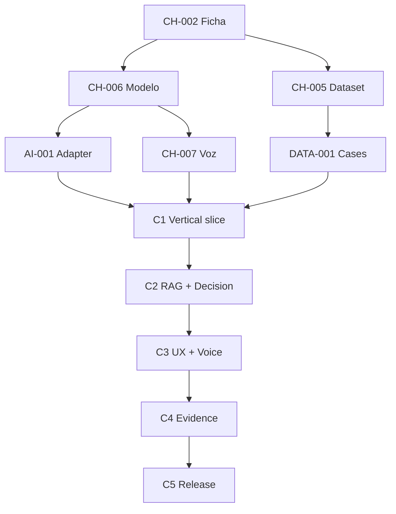

# Care Companion — Delivery Plan

> SDD v0.1 · 23 de julio de 2026  
> Ventana pública: construcción 7–10 de agosto de 2026; revisión 10–18 de agosto; final 5 de septiembre.  
> Propietario: SG · Ejecución individual, con Codex/Claude como asistentes de código bajo `spec.md`.

## 1. Objetivo de entrega

Entregar un agente de voz postoperatorio en español que supere las cinco compuertas eliminatorias y maximice los 100 puntos:

| Rúbrica | Puntos | Objetivo de entrega |
|---|---:|---|
| RAG, precisión clínica y conocimiento vivo | 20 | citas completas, upload/delete transaccional, learn/forget demostrado |
| Decisión y escalamiento | 20 | reglas no degradables, evaluación estructurada, handoff explicable |
| Problema y conversación | 15 | flujo clínico realista, regionalismos, ambigüedad, preguntas adaptativas |
| Voz | 15 | realtime, baja latencia, barge-in, recuperación |
| Video y demo | 15 | argumento claro, demo E2E sin montaje engañoso |
| Repositorio y proceso | 15 | ≤15 min, README, tests, commits, ADR, métricas, MIT |

## 2. Reglas de ejecución

### 2.1 Estados

`Backlog → Ready → In progress → In review → Verified → Done`

Estados excepcionales: `Blocked`, `Descoped`, `Superseded`.

### 2.2 Definition of Ready

Un ticket puede empezar cuando:

- tiene requisito/criterio de rúbrica asociado;
- alcance y no-alcance están claros;
- dependencias satisfechas;
- criterio de aceptación observable;
- evidencia esperada definida;
- no requiere una decisión abierta no resuelta.

### 2.3 Definition of Done

Un ticket está `Done` cuando:

- implementación y prueba están completas;
- checks relevantes pasan;
- evidencia quedó guardada;
- contrato/docs/ADR se actualizaron si aplica;
- no contiene secretos, datos reales ni activos sin licencia;
- el cambio está asociado a un commit intencional;
- no rompe una compuerta existente.

### 2.4 Evidencia por ticket

Cada ticket conserva:

```yaml
ticket_id:
status:
started_at:
completed_at:
commit_sha:
requirements:
tests:
artifacts:
metrics_before:
metrics_after:
decisions:
risks:
review_notes:
```

### 2.5 Disciplina de tiempo

- un ticket a la vez en implementación crítica;
- WIP máximo: 1 ticket de código + 1 tarea de documentación;
- commits pequeños por comportamiento verificable;
- si un spike no concluye en su timebox, se adopta la opción más simple que cumpla;
- ningún refactor cosmético desplaza una compuerta;
- freeze de features antes del cierre; después solo correcciones P0/P1.

## 3. Hitos y sprints

| Fase | Sprint | Ventana | Resultado |
|---|---|---|---|
| P — Preparación | P0 Discovery | 23–24 jul | SDD, rúbrica, riesgos, límites |
| P — Preparación | P1 Readiness | 25–29 jul | ambiente y checklists genéricos, sin solución material-específica |
| P — Preparación | P2 Rehearsal | 30 jul–2 ago | ensayos desechables de proceso y demo |
| P — Preparación | P3 Freeze | 3–6 ago | agenda T0, herramientas, descanso y contingencias |
| C — Concurso | C0 Intake | T0–T+2h | ficha/modelo/dataset/starter congelados en contratos |
| C — Concurso | C1 Vertical Slice | T+2h–T+12h | llamada mínima E2E con un caso |
| C — Concurso | C2 Clinical Core | T+12h–T+28h | RAG vivo, decisión, citas, resumen |
| C — Concurso | C3 Experience | T+28h–T+44h | voz robusta y tres vistas completas |
| C — Concurso | C4 Evidence | T+44h–T+58h | evals, métricas, seguridad y documentación |
| C — Concurso | C5 Release | últimas 6h | clean-room, video, entrega y recibo |
| R — Revisión | R0 Preserve | 10–18 ago | release congelado y respuestas preparadas |
| F — Finalistas | F0 Live Demo | 19 ago–4 sep | demo resiliente y defensa |
| I — Integración | I0 Productization | posterior | capacidad reusable, sin datos/código del concurso no autorizados |
| I — Integración | I1 `caregaps-agent` | posterior | adapter/feature bajo controles institucionales |

La hora exacta de T0/cierre y zona horaria se reemplazan con la ficha técnica; no se adivinan.

## 4. Fase P — Preparación previa

Esta fase respeta el propósito del concurso de iniciar con el mismo starter/dataset/modelo el 7 de agosto. Se limita a planeación, ambiente, plantillas, checklists y ensayos genéricos desechables. No incorpora materiales no publicados ni pretende entregar una solución anticipada.

### Sprint P0 — Discovery & SDD · 23–24 jul

| Ticket | P | Tareas | Aceptación | Evidencia | Estado |
|---|---:|---|---|---|---|
| PRE-001 Validar reto público | P0 | leer reto, entregables, compuertas, rúbrica, cronograma, FAQ y términos; registrar lo no publicado | matriz refleja 5 gates y 6 criterios exactos | links + notas fechadas | Done |
| PRE-002 Crear SDD baseline | P0 | redactar `architecture.md`, `design.md`, `plan.md`, `spec.md`; revisar coherencia | los cuatro docs comparten alcance, IDs y decisiones | archivos v0.1 | Done |
| PRE-003 Registrar decisiones abiertas | P0 | enumerar modelo, dataset, voz, credenciales, métricas, licencia y deadline | cada pregunta tiene ticket T0 asociado | sección OQ de `spec.md` | Done |
| PRE-004 Definir límites de IP/confidencialidad | P0 | separar concepto reusable de material institucional; regla de foto/logo; datos públicos | release gate prohíbe secretos, PHI y activos no autorizados | checklist IP | Done |
| PRE-005 Seleccionar dirección visual | P1 | comparar tres primeras vistas; elegir/combinar una; congelar tokens | decisión registrada y mockup seleccionado | `design.md` v0.2 + handoff v1.0 (Family-first Pediatric) + mockup `dashboard.tsx`/`globals (1).css` | Done |
| PRE-006 Crear matriz de trazabilidad | P1 | mapear requisito→ticket→test→evidencia→rúbrica | ningún gate queda sin owner/evidencia | `docs/traceability.md` v0.1 — 104 requisitos mapeados, 5 gates y 6 criterios con owner, 24 Pendiente-T0, huecos FR-004/FR-054 declarados | Done |

### Sprint P1 — Readiness · 25–29 jul

| Ticket | P | Tareas | Aceptación | Evidencia | Estado |
|---|---:|---|---|---|---|
| PRE-010 Verificar estación de trabajo | P0 | espacio, Docker, Python, Node, navegador, micrófono, cámara, grabación, Git/GitHub | checklist verde y plan B documentado | `docs/evidence/pre-010-workstation.md` — stack verificado; micrófono/cámara/grabación/plan B pendientes (humano) | In review |
| PRE-011 Preparar reloj de clean install | P0 | cronómetro, VM/contenedor limpio, plantilla de log | puede medir T0→ready sin pasos manuales ocultos | `docs/templates/clean-install-log.md`; VM/contenedor limpio pendiente (humano) | In review |
| PRE-012 Preparar gestión de secretos | P0 | password manager, `.env.example` template, secret scanner, rotación | ningún secreto necesita copiarse a docs o Git | scan sample | Backlog |
| PRE-013 Preparar convenciones Git | P1 | branch/commit format, ticket IDs, PR/self-review checklist | cada cambio es rastreable | `CONTRIBUTING.md` v0.1 (rama base `main` aplicada al repo) | Done |
| PRE-014 Preparar templates de ADR | P1 | contexto, opciones, decisión, riesgos, revisión | ADR se completa en <10 min | `docs/templates/adr-template.md` v0.1 con ejemplo diligenciado | Done |
| PRE-015 Preparar evidence ledger | P1 | estructura de capturas, logs, métricas, prompts/config y demo | cada evidencia tiene fecha/ticket/commit | `docs/templates/evidence-ledger.md` v0.1 (schema §2.4 + convención `docs/evidence/<ID>/`) | Done |
| PRE-016 Definir política de dependencias | P1 | licencias, lockfiles, vulnerabilidades, criterio add/remove | dependencia nueva exige necesidad y licencia | `docs/policies/dependencies.md` v0.1 | Done |
| PRE-017 Preparar casos conversacionales ficticios | P1 | routine, ambiguous, urgent, contradiction, no evidence | casos no copian dataset y tienen expected behavior abstracto | catálogo de escenarios | Backlog |
| PRE-018 Preparar glosario colombiano genérico | P2 | expresiones ambiguas sin inferir diagnóstico; reglas de aclaración | cada término exige confirmación contextual | fixture no clínico | Backlog |

### Sprint P2 — Rehearsal desechable · 30 jul–2 ago

| Ticket | P | Tareas | Aceptación | Evidencia | Estado |
|---|---:|---|---|---|---|
| PRE-020 Ensayar flujo de trabajo | P1 | simular recepción de repo, intake, ADR, vertical slice y release con proyecto toy | identifica cuellos de botella; código no se incorpora si reglas no lo permiten | tiempos y retrospectiva | Backlog |
| PRE-021 Ensayar captura de video | P1 | audio, cámara, resolución, zoom, privacidad y backup | voz y UI legibles; sin notificaciones/datos privados | video desechable | Backlog |
| PRE-022 Ensayar fallo de red | P1 | hotspot/segundo enlace, descarga de dependencias permitida, recuperación Git | plan de continuidad probado | checklist | Backlog |
| PRE-023 Ensayar micrófono/navegador | P1 | permisos, eco, auriculares, barge-in manual | ruta principal y alternativa funcionan | registro | Backlog |
| PRE-024 Ensayar explicación de 2 preguntas | P2 | problema/valor y decisión técnica/opciones/riesgos/2 semanas | respuestas preliminares ≤90 s cada una | guion v0 | Backlog |
| PRE-025 Revisar accesibilidad del mockup | P2 | contraste, foco, labels, color, reduced motion | sin blockers AA en primera vista | auditoría | Backlog |
| PRE-026 Preparar consulta de dudas al organizador | P2 | consolidar solo preguntas no publicadas | correo listo, sin solicitar material anticipado | borrador | Backlog |

### Sprint P3 — Freeze · 3–6 ago

| Ticket | P | Tareas | Aceptación | Evidencia | Estado |
|---|---:|---|---|---|---|
| PRE-030 Congelar baseline SDD | P0 | revisar docs; registrar supuestos; no seguir expandiendo alcance | v0.2 fechada y consistente | tag/versión | Backlog |
| PRE-031 Preparar agenda T0 | P0 | checklist de correo, descarga, lectura, decisiones y timeboxes | primeros 120 min definidos | agenda | Backlog |
| PRE-032 Preparar matriz de decisión de voz | P0 | WebSocket pipeline vs realtime provider; criterios y cutoff | decisión posible en 90 min | scorecard | Backlog |
| PRE-033 Preparar matriz de decisión de RAG | P1 | corpus/volumen→SQLite hybrid o adapter alterno | decisión posible en 45 min | scorecard | Backlog |
| PRE-034 Actualizar/copiar herramientas offline permitidas | P1 | Docker images/caches solo si reglas lo permiten; verificar licencias | no depende de herramientas no autorizadas | inventory | Backlog |
| PRE-035 Verificar registro y correo | P0 | preinscripción, spam, zona horaria, canal de soporte | material localizable en T0 | checklist | Backlog |
| PRE-036 Plan de salud y turnos | P0 | bloques de foco, comida, sueño y buffers | no planear 72h continuas sin descanso | calendario | Backlog |
| PRE-037 Stop-work preinicio | P0 | no crear solución final antes de T0; preservar equidad | cumplimiento explícito | nota de freeze | Backlog |

## 5. Fase C — Construcción del concurso

## Sprint C0 — Intake & Constraint Freeze · T0–T+2h

**Objetivo:** reemplazar supuestos por hechos antes de construir.

| Ticket | P | Timebox | Tareas | Aceptación / evidencia |
|---|---:|---:|---|---|
| CH-001 Preservar material original | P0 | 10m | guardar starter/ficha/checksums/links; registrar recepción | fuente original identificable |
| CH-002 Leer ficha completa | P0 | 25m | modelo, gates, métricas, deadline, stack permitido, disclosure IA | checklist sin campos vacíos |
| CH-003 Revisar licencias/uso de datos | P0 | 15m | starter, dataset, documentos, credenciales y salida pública | decisión de qué puede versionarse |
| CH-004 Inspeccionar repo base | P0 | 15m | estructura, scripts, tests, Docker, constraints | inventory y gaps |
| CH-005 Perfilar Delta Share | P0 | 20m | schema, volumen, tipos, nulls, ejemplos autorizados | `data-contract.md`/schema snapshot |
| CH-006 Validar modelo obligatorio | P0 | 15m | endpoint, SDK, output estructurado, streaming, límites, costo | smoke trace con model id |
| CH-007 Elegir pipeline de voz | P0 | 25m | spike mínimo opciones; medir primer audio y barge-in posible | ADR-007 |
| CH-008 Delta de requisitos | P0 | 15m | actualizar `spec/architecture/plan`; crear tickets nuevos; resolver FR-004 (consentimiento) según exigencia de la ficha | v1.0 sin supuestos críticos; FR-004 con ticket o descope registrado |
| CH-009 Congelar alcance P0/P1/P2 | P0 | 10m | MoSCoW, cutline y exclusiones | backlog ordenado |
| CH-010 Baseline repo | P0 | 10m | licencia/branch/initial checks según reglas | commit inicial trazable |

**Exit gate C0**

- [ ] deadline y zona confirmados;
- [ ] un solo modelo configurado;
- [ ] dataset/credenciales/licencias comprendidos;
- [ ] voz y arquitectura decididas;
- [ ] ninguna compuerta sin ticket P0.

## Sprint C1 — Vertical Slice · T+2h–T+12h

**Objetivo:** obtener pronto una ruta desplegable de micrófono a respuesta y resumen con un caso, aunque todavía no esté pulida.

| Ticket | P | Est. | Tareas | Aceptación / evidencia |
|---|---:|---:|---|---|
| REP-001 Estructura del repo | P0 | 30m | respetar starter; separar `web`, `api`, docs/config | build inicial |
| REP-002 Config y settings | P0 | 30m | Pydantic settings, env validation, provider allowlist | test de config |
| REP-003 Lockfiles y scripts | P0 | 30m | install/dev/test/build/verify idempotentes | ejecución limpia |
| DB-001 Schema operacional | P0 | 45m | sessions, turns, events, documents, chunks, citations, metrics | migration + schema test |
| DB-002 SQLite WAL/repositorios | P0 | 30m | transacciones cortas, foreign keys, isolation | concurrency smoke |
| DATA-001 Delta Share adapter | P0 | 60m | solo lectura, schema mapping, case list/detail | integration test con caso |
| AI-001 Model adapter | P0 | 45m | una única implementación activa, structured output, usage | contract test + trace |
| ORC-001 State machine skeleton | P0 | 60m | estados y transiciones happy path/fail-safe | unit tests |
| API-001 REST skeleton | P0 | 30m | health, cases, sessions, finish | OpenAPI + tests |
| API-002 WebSocket protocol | P0 | 45m | envelopes, sequence, disconnect, error | WebSocket test |
| VOI-001 STT mínimo | P0 | 60m | audio→final transcript | demo/log |
| VOI-002 TTS mínimo | P0 | 45m | response text→audio | demo/log |
| FE-001 App shell | P0 | 45m | rutas y primera vista elegida | screenshot |
| FE-002 Mic/transcript | P0 | 60m | permisos, connect, partial/final, playback | browser evidence |
| SUM-001 Summary skeleton | P0 | 30m | JSON schema con session/case/turns | validation test |
| OBS-001 Event/trace skeleton | P0 | 30m | correlation_id y timings por etapa | trace de una llamada |
| E2E-001 Golden-path smoke | P0 | 45m | iniciar→hablar→responder→cerrar→resumir | test/recording |

**Exit gate C1**

- [ ] app arranca con proceso documentable;
- [ ] una llamada completa funciona;
- [ ] dataset real alimenta un caso;
- [ ] modelo obligatorio aparece en trace;
- [ ] no hay datos/secretos en Git;
- [ ] checkpoint de código estable.

## Sprint C2 — Clinical Core · T+12h–T+28h

### Epic RAG — conocimiento vivo

| Ticket | P | Est. | Tareas | Aceptación / evidencia |
|---|---:|---:|---|---|
| RAG-001 Documento/version schemas | P0 | 35m | ids, checksum, estado, aplicabilidad, knowledge_version | migration + unit |
| RAG-002 Upload validation | P0 | 45m | allowlist tipo/tamaño/nombre, duplicate handling | negative tests |
| RAG-003 Extract/chunk | P0 | 60m | páginas/secciones, chunk ids estables, metadata | fixture snapshot |
| RAG-004 Embeddings adapter | P0 | 45m | único modelo permitido/compatible; batching/cache | contract test |
| RAG-005 FTS5 + vector retrieval | P0 | 75m | BM25, cosine, filters, RRF | retrieval eval |
| RAG-006 Evidence gate | P0 | 45m | threshold, applicability, conflict, abstention | unit matrix |
| RAG-007 Citation contract | P0 | 35m | doc/version/page/section/chunk por claim/turn | trace test |
| RAG-008 Hot learn transaction | P0 | 45m | write→increment→canary→ready | E2E positive |
| RAG-009 Delete/forget transaction | P0 | 60m | index/cache purge, tombstone, canary negative | E2E deletion |
| RAG-010 Knowledge API | P0 | 45m | list/upload/status/delete/search debug | API tests |
| RAG-011 Knowledge UI | P0 | 75m | state machine, canaries, source drawer, delete confirm | demo recording |

### Epic Conversation & Decision

| Ticket | P | Est. | Tareas | Aceptación / evidencia |
|---|---:|---:|---|---|
| CON-001 Observation schema | P0 | 30m | original, normalized, certainty, source turn | validation tests |
| CON-002 InterviewAgent | P0 | 60m | open question, extraction, missing info, clarification | scenario eval |
| CON-003 Colombian ambiguity handling | P1 | 45m | glosario/context clarification, no assumptions | ambiguous E2E |
| SAFE-001 Rule engine | P0 | 60m | versioned red flags, inputs, precedence | 100% critical branches |
| SAFE-002 TriageAgent | P0 | 60m | structured risk + evidence + missing info | schema/eval |
| SAFE-003 Decision reducer | P0 | 45m | combine rules/model; prohibit downgrade | adversarial unit tests |
| SAFE-004 Escalation record | P0 | 35m | idempotent simulated alert | duplicate test |
| RES-001 ResponseAgent | P0 | 60m | concise Spanish, evidence-only, handoff/abstain | groundedness eval |
| SUM-002 Structured summary | P0 | 45m | reported/denied/not assessed/decision/citations | golden snapshot |
| ORC-002 Complete transitions | P0 | 60m | clarification, escalate, fail-safe, close | state coverage |
| E2E-002 Clinical scenarios | P0 | 75m | routine, urgent, ambiguous, contradiction, no evidence | results table |

**Exit gate C2**

- [ ] upload/learn y delete/forget funcionan sin reinicio;
- [ ] cada respuesta clínica tiene citas o abstención;
- [ ] red flag no es degradable;
- [ ] resumen separa hecho/negación/no evaluado;
- [ ] casos críticos no tienen falsos negativos.

## Sprint C3 — Voice & Experience · T+28h–T+44h

### Epic Voice

| Ticket | P | Est. | Tareas | Aceptación / evidencia |
|---|---:|---:|---|---|
| VOI-010 Audio chunking/backpressure | P0 | 45m | sequence, bounded queue, drop policy segura | load test |
| VOI-011 VAD/end-of-turn | P0 | 45m | inicio/fin sin cortes frecuentes | recordings |
| VOI-012 Partial/final transcript | P0 | 35m | reconciliation sin duplicar turnos | tests |
| VOI-013 Streaming TTS | P0 | 45m | primera salida temprana y chunks ordenados | latency trace |
| VOI-014 Barge-in | P0 | 60m | detect→cancel→ack→new turn | E2E/video |
| VOI-015 Reconnect/disconnect | P1 | 45m | resume limitado o cierre seguro | chaos test |
| VOI-016 Text fallback | P1 | 30m | continuar demo si falla TTS/mic | browser test |
| VOI-017 Audio cleanup | P2 | 30m | eco/noise settings si medidamente útiles | before/after |

### Epic UI/UX

| Ticket | P | Est. | Tareas | Aceptación / evidencia |
|---|---:|---:|---|---|
| UX-001 Call layout | P0 | 60m | visual contract, responsive desktop | screenshot diff |
| UX-002 Voice states | P0 | 45m | ready/listen/think/speak/interrupted/error | state story/test |
| UX-003 Evidence panel | P0 | 45m | 2 fuentes, ubicación y trace navigation | interaction test |
| UX-004 Risk/supervision | P0 | 45m | nivel, señales, paso y acción simulada | accessibility test |
| UX-005 Audit timeline | P1 | 75m | agentes, reglas, citas, timings, usage | demo |
| UX-006 Knowledge polish | P1 | 45m | learn/forget visible y honesto | demo |
| UX-007 Empty/error/loading states | P1 | 45m | no falsos éxitos, recovery copy | state matrix |
| UX-008 Accessibility | P0 | 60m | keyboard, focus, contrast, labels, reduced motion | automated + manual |
| UX-009 Authorized imagery | P1 | 20m | activo propio/licenciado o placeholder correcto | license record |
| E2E-003 Judge journey | P0 | 60m | call→evidence→alert→summary→audit→learn→forget | full recording |

**Exit gate C3**

- [ ] conversación se siente realtime;
- [ ] barge-in demostrable;
- [ ] primera vista muestra voz/evidencia/riesgo/supervisión;
- [ ] learn/forget no es UI simulada;
- [ ] flujo crítico accesible por teclado.

## Sprint C4 — Evidence, Quality & Deliverables · T+44h–T+58h

### Calidad y evaluación

| Ticket | P | Est. | Tareas | Aceptación / evidencia |
|---|---:|---:|---|---|
| TST-001 Unit suite crítica | P0 | 60m | rules, reducer, schemas, citations, deletion | thresholds cumplidos |
| TST-002 Integration suite | P0 | 60m | DB, Delta, model, WebSocket, documents | report |
| TST-003 E2E gates | P0 | 75m | 5 gates + cases spec | green run |
| EVA-001 RAG eval | P0 | 60m | recall@k, citation precision, groundedness, deletion | metrics table |
| EVA-002 Decision eval | P0 | 60m | red flags, false negatives, escalation explanation | confusion/results |
| EVA-003 Conversation eval | P1 | 45m | ambiguity, naturalness checklist, goal coverage | rubric |
| PERF-001 Latency instrument | P0 | 35m | stage timings and call aggregation | trace |
| PERF-002 Benchmark P50/P95 | P0 | 60m | sample size/formato oficial | reproducible report |
| COST-001 Tokens/cost | P0 | 35m | per-agent/call, provider pricing/config | report |
| REL-001 Clean-install timing | P0 | 45m | clean checkout to ready ≤15 min | timestamped log/video |

### Seguridad y cumplimiento

| Ticket | P | Est. | Tareas | Aceptación / evidencia |
|---|---:|---:|---|---|
| SEC-001 Secret scan | P0 | 20m | repo/history/env/build context | zero findings |
| SEC-002 PII/PHI review | P0 | 25m | fixtures, logs, screenshots, video | signed checklist |
| SEC-003 Upload/prompt injection | P1 | 45m | malicious docs, path/MIME/size | negative tests |
| SEC-004 Dependency/license scan | P0 | 30m | CVE/license + attribution | report/NOTICE |
| SEC-005 IP/brand review | P0 | 25m | hospital/organizer assets, dataset docs | every asset authorized/replaced |
| SEC-006 Model allowlist scan | P0 | 15m | code/config/traces | only mandatory model |

### Entregables

| Ticket | P | Est. | Tareas | Aceptación / evidencia |
|---|---:|---:|---|---|
| DOC-001 README | P0 | 90m | prerequisites, credentials, ≤15m, run/test/demo/troubleshoot, metrics | clean-room reviewer follows it |
| DOC-002 Architecture diagram | P0 | 45m | system + decision flow legible/exported | linked artifact |
| DOC-003 Final report | P0 | 90m | process, prompts/config, captures, decisions, evals, limits | checklist organizer complete |
| DOC-004 Prompt/config appendix | P0 | 45m | versions, roles, parameters, hashes, no CoT/secrets | reproducible appendix |
| DOC-005 Demo storyboard | P0 | 35m | sequence, input exacto, expected output, backup | rehearsal |
| DOC-006 Video script | P0 | 60m | argument, demo, two questions, timing | timed rehearsal |
| DOC-007 MIT/NOTICE | P0 | 20m | root LICENSE, author/year, third-party notices | compliance check |
| DOC-008 Limitations & safety | P1 | 30m | prototype, no diagnosis/EHR, data boundaries | README/report visible |
| DOC-009 Export de evidencia de demo | P1 | 30m | export JSON/CSV de sesión/decisiones/citas sin secretos ni datos no autorizados (FR-054) | archivo exportado validado contra schema |

**Exit gate C4**

- [ ] gates E2E verdes;
- [ ] métricas oficiales reportadas;
- [ ] clean install cronometrado ≤15 min;
- [ ] cero secretos/PHI/IP blockers;
- [ ] repo/diagrama/informe/video listos para release;
- [ ] feature freeze activado.

## Sprint C5 — Final Release · últimas 6 horas

| Ticket | P | Timebox | Tareas | Aceptación / evidencia |
|---|---:|---:|---|---|
| FIN-001 Crear release candidate | P0 | 20m | commit/tag/version; freeze | SHA registrado |
| FIN-002 Clean-room final | P0 | 60m | clonar público, README exacto, credenciales autorizadas, run demo | ≤15m y log |
| FIN-003 Ejecutar gate suite final | P0 | 45m | unit/integration/E2E/build/license/secret | reporte verde |
| FIN-004 Rehearsar demo | P0 | 30m | recorrido exacto + fallback | dentro de tiempo |
| FIN-005 Grabar video | P0 | 60m | pantalla + cámara al cierre + 2 preguntas | audio/video revisados |
| FIN-006 Revisar video/capturas | P0 | 25m | legibilidad, privacidad, sin notificaciones | checklist |
| FIN-007 Finalizar informe/links | P0 | 30m | SHAs, métricas, URLs y capturas correctas | cross-link check |
| FIN-008 Validar 4 entregables | P0 | 15m | repo, diagrama, informe, video | gate manual |
| FIN-009 Enviar antes del buffer | P0 | 15m | formulario/canal exacto | confirmación |
| FIN-010 Preservar recibo | P0 | 10m | screenshots, timestamp, hashes, URL pública | paquete de evidencia |
| FIN-011 Buffer de contingencia | P0 | 60m+ | solo P0 blockers; no features | release no empeora |

### Orden de sacrificio si falta tiempo

1. P2 polish/animaciones;
2. filtros avanzados de auditoría;
3. reranker adicional;
4. responsive móvil completo;
5. reconnect sofisticado;
6. exportadores secundarios.

Nunca sacrificar: cinco gates, modelo único, seguridad, citas, precedencia, resumen, README, cuatro entregables.

## 6. Fase R — Revisión · 10–18 ago

| Ticket | P | Tareas | Aceptación / evidencia |
|---|---:|---|---|
| POST-001 Congelar submission | P0 | tag, hash, release notes, backup | estado enviado reproducible |
| POST-002 Crear branch post-submit | P1 | separar correcciones futuras | submission no cambia |
| POST-003 Preparar Q&A técnico | P1 | arquitectura, RAG, decisión, voz, costos, riesgos | answers sheet |
| POST-004 Registrar retrospectiva | P1 | qué funcionó/falló, deuda, 2-week plan | retrospective |
| POST-005 Monitorear comunicación | P0 | correo/spam/canales | respuesta oportuna |
| POST-006 Reproducir reporte si solicitan | P1 | usar mismo tag/env | resultados consistentes |

## 7. Fase F — Preparación de finalistas · 19 ago–4 sep

| Ticket | P | Tareas | Aceptación / evidencia |
|---|---:|---|---|
| FINL-001 Confirmar formato panel | P0 | tiempo, conexión, equipos, remoto/presencial | constraints |
| FINL-002 Demo live endurecida | P0 | local/hosted fallback, seed reset, preflight | 5 ensayos seguidos |
| FINL-003 Fallos inyectados | P1 | red, model timeout, mic, delete, reconnect | recuperación visible |
| FINL-004 Defensa técnica | P0 | opciones descartadas, tradeoffs, riesgos, dos semanas | 5–7 min clara |
| FINL-005 Pitch de valor | P0 | problema, impacto, diferencial, límites | 60–90 s |
| FINL-006 Ensayo panel hostil | P1 | safety, accuracy, hallucination, cost, privacy, scaling | respuestas concisas |
| FINL-007 Revisar métricas | P0 | recalcular desde tag | cifras trazables |
| FINL-008 Equipo y contingencia | P0 | laptop, cargador, hotspot, audio, copia local | checklist |
| FINL-009 Freeze final | P0 | build/tag/preflight | demo idéntica al ensayo |

## 8. Fase I0 — Productización posterior

Esta fase no forma parte del concurso y requiere revisar licencia del starter/dataset/documentos antes de reutilizar componentes.

| Ticket | P | Tareas | Aceptación |
|---|---:|---|---|
| PROD-001 IP extraction review | P0 | separar código propio, organizer assets y datos | componente reusable legalmente claro |
| PROD-002 Threat model clínico | P0 | PHI, identity, prompt injection, audio, model/provider, EHR | riesgos/controles aprobados |
| PROD-003 Clinical governance | P0 | owner de reglas, revisión, vigencia y validation set | change control formal |
| PROD-004 Auth/RBAC | P0 | SSO, roles, least privilege | pruebas de autorización |
| PROD-005 Postgres/event migration | P1 | repositorios/queue según volumen | load/SLO |
| PROD-006 Managed vector search | P1 | adapter, sync, deletion semantics | parity suite |
| PROD-007 Object storage | P1 | encrypted docs, lifecycle, deletion | retention tests |
| PROD-008 Observability platform | P0 | traces, eval, alerts, audit retention | dashboards/SLO |
| PROD-009 Model governance | P0 | allowlist, eval gates, rollback, cost budgets | promotion workflow |
| PROD-010 Clinical validation | P0 | clinician review, false-negative policy, usability | approval evidence |
| PROD-011 Privacy/compliance | P0 | HIPAA/org policies, BAA, retention, consent | legal/security signoff |
| PROD-012 Pilot | P0 | synthetic→silent mode→limited users | exit criteria met |

## 9. Fase I1 — Integración con `caregaps-agent`

| Ticket | P | Tareas | Aceptación |
|---|---:|---|---|
| INT-001 Context boundary | P0 | definir qué datos mínimos recibe/devuelve la capacidad | contrato aprobado |
| INT-002 Capability interface | P0 | `PostOpFollowUpCapability` + schemas versionados | contract tests |
| INT-003 Tool registration | P1 | registrar capacidad en tool registry, routing explícito | agente enruta solo casos aplicables |
| INT-004 Orchestrator boundary | P0 | `caregaps-agent` inicia; Care Companion controla su workflow | no doble orquestación |
| INT-005 Databricks data adapter | P0 | allowlists, catalog/schema/env suffix | no acceso fuera de alcance |
| INT-006 Vector Search adapter | P1 | index y metadata filters, deletion/version parity | RAG parity |
| INT-007 Observability adapter | P0 | MLflow tracing/usage/events fail-open | traces correlacionadas |
| INT-008 Output+metadata contract | P0 | separar contenido visible y cápsula metadata | compatibility tests |
| INT-009 Epic read boundary | P0 | scopes, mapping, minimización, idempotency | security review |
| INT-010 Human approval | P0 | confirmación antes de toda escritura/acción | no autonomous write path |
| INT-011 Epic write adapter | P2 | solo tras aprobación institucional | audit/reconciliation |
| INT-012 Deployment targets | P1 | dev primero; no test/prod sin autorización | config validation |
| INT-013 Evaluation parity | P0 | care gaps + post-op suites sin regresión | promotion gate |
| INT-014 UX integration | P1 | funcionalidad completa reflejada en UI | traceability review |
| INT-015 Pilot/rollback | P0 | limited rollout, kill switch, rollback | runbook probado |

## 10. Matriz de trazabilidad de compuertas

| Gate | Tickets responsables | Test | Evidencia |
|---|---|---|---|
| 4 entregables | DOC-002/003/006, FIN-008 | checklist release | URLs/hashes |
| ≤15 min | REP-003, REL-001, FIN-002 | clean-room timer | log/video |
| modelo único | CH-006, AI-001, SEC-006 | code/config/trace scan | model id |
| voz realtime | API-002, VOI-001/002/010–015 | E2E voice | video + P50/P95 |
| learn/forget | RAG-008/009/011 | positive+deletion E2E | canaries + trace |

## 11. Matriz de trazabilidad de rúbrica

| Criterio | Tickets principales |
|---|---|
| RAG 20 | RAG-001–011, EVA-001, UX-003/006 |
| Decisión 20 | SAFE-001–004, ORC-002, EVA-002, UX-004 |
| Conversación 15 | CON-001–003, RES-001, SUM-002, EVA-003 |
| Voz 15 | VOI-001/002/010–017, PERF-001/002, UX-002 |
| Video 15 | PRE-021/024, DOC-005/006, FIN-004–006 |
| Repo/proceso 15 | REP-001–003, DOC-001/004/007, TST-001–003, FIN-001–003 |

## 12. Dependencias críticas



## 13. Registro de riesgos operativo

| ID | Trigger | Respuesta | Owner |
|---|---|---|---|
| RK-001 ficha contradice SDD | diferencia material T0 | ADR delta + replan P0 en 20 min | SG |
| RK-002 modelo sin audio | smoke falla | WebSocket STT/LLM/TTS | SG |
| RK-003 Delta Share falla | no case read en 45 min | diagnosticar auth/schema; escalar soporte; fixture solo si reglas permiten | SG |
| RK-004 RAG complejo | no eval útil tras 2h | FTS5+vector simple; eliminar reranker | SG |
| RK-005 voz inestable | P95/gaps altos | reducir turn size; text fallback; preservar realtime gate | SG |
| RK-006 delete incompleto | canary encuentra contenido | bloquear `deleted`, rollback y corregir | SG |
| RK-007 falso negativo crítico | cualquier critical miss | bloquear release; ampliar regla/test | SG |
| RK-008 instalación >15m | ensayo excede | reducir servicios/deps/images; precalcular solo lo permitido | SG |
| RK-009 secreto/PHI/IP | scan/review detecta | remover de working tree/history/artifacts; rotar secreto | SG |
| RK-010 falta tiempo | burn-down fuera de cutline | aplicar orden de sacrificio; freeze temprano | SG |
| RK-011 IA propone cambio inseguro | contradice spec | rechazar, registrar y pedir decisión humana | SG |
| RK-012 caída de internet | pérdida sostenida | hotspot, trabajo local, upload buffer | SG |

## 14. Métricas de gestión

Durante la ejecución:

- gates verdes / 5;
- puntos cubiertos con evidencia / 100;
- tickets P0 verified / total P0;
- defectos P0 abiertos;
- instalación limpia en minutos;
- voice P50/P95;
- critical false negatives;
- citation precision/groundedness;
- learn/delete canaries;
- secretos/PHI/IP blockers;
- tiempo restante vs buffer.

## 15. Cadencia de seguimiento

### Antes del concurso

- cierre diario corto: decisiones, blockers, siguiente ticket;
- no generar código final material-específico;
- revisión final el 6 de agosto.

### Durante el concurso

- cada 4 horas: gates, puntos, P0 blockers, burn-down;
- después de cada sprint: checkpoint estable + evidencia;
- 12 horas antes del cierre: feature freeze;
- 6 horas antes: release sprint;
- 1 hora mínimo: buffer no comprometido.

### Auditoría final

- exportar ledger de tickets;
- conservar commit/tag de submission;
- guardar logs de tests, clean install y métricas;
- guardar hashes/URLs/recibo;
- preservar materiales originales del reto separados de artefactos propios.

## 16. Checklist ejecutivo

### Hoy

- [x] reto público revisado íntegramente;
- [x] arquitectura, especificación, diseño y plan v0.1;
- [x] límites de integración con `caregaps-agent`;
- [x] seleccionar dirección visual (Family-first Pediatric, 23 jul);

### Antes del 7 de agosto

- [ ] registro/correo confirmado;
- [ ] entorno, audio, cámara, Git y contingencias probados;
- [ ] templates de evidencia/ADR/traceability listos;
- [ ] plan de descanso y buffers;
- [ ] stop-work preinicio respetado.

### En T0

- [ ] ficha, modelo, dataset, credenciales y deadline confirmados;
- [ ] SDD delta v1.0;
- [ ] alcance P0 congelado;
- [ ] vertical slice iniciado antes de T+2h.

### Antes de enviar

- [ ] 5/5 gates;
- [ ] evidencia para 100/100 puntos;
- [ ] 0 P0 defects;
- [ ] ≤15 min clean install;
- [ ] only mandatory model;
- [ ] 0 secrets/PHI/IP blockers;
- [ ] repo + diagram + report + video;
- [ ] MIT root;
- [ ] submit + receipt + hashes.

